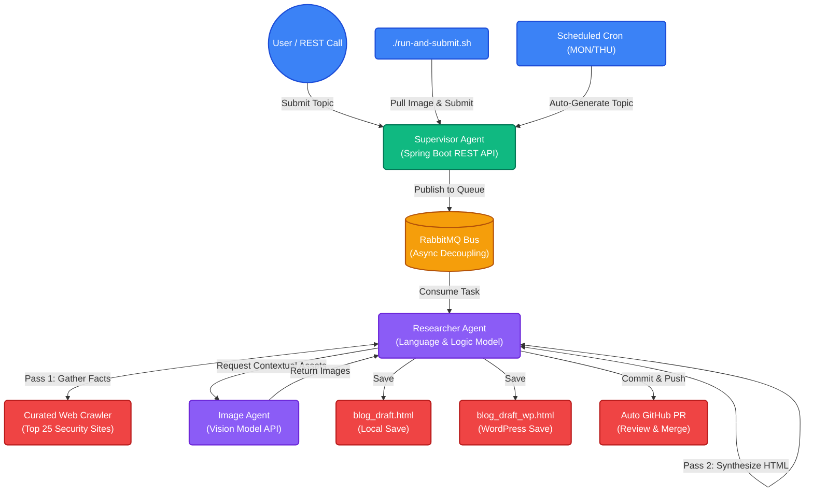

# 🤖 Spring AI Autonomous Blog Agent

   

**A highly robust, multi-agent AI system built to run complex asynchronous tasks utilizing Spring Boot and local/private Large Language Models (LLMs).**

This project demonstrates the true power of scaling robust Java application logic (Spring Boot) and asynchronous event-driven queues (RabbitMQ) with LLMs. By decoupling HTTP requests from long-running inference tasks, it achieves incredible resilience, making it perfect for pairing with powerful frontier models or private, locally-hosted LLMs (like `qwen3.5:9b`).

---

## 🚀 The Power of the Architecture

When working with LLMs, inference takes time—especially when executing a multi-pass reasoning chain that involves deep-dive web crawling, fact synthesis, and image generation. Traditional synchronous REST APIs often time out or lock up valuable threads during these operations.

**This agent solves that problem.**

By utilizing a **RabbitMQ message bus**, the system instantly accepts a large batch of research topics and frees up the HTTP thread. The specialized agents then process the tasks sequentially or in parallel without any risk of protocol timeouts.

### 🧠 Multi-Agent Microservices Workflow



### Why Specialized Agents?
Complex visual work is delegated to a separate, dedicated **Image Agent** running specific vision models (e.g., `qwen3-vl:latest`). This keeps the **Researcher Agent** focused strictly on language, analysis, and HTML drafting, drastically reducing hallucinations and formatting errors.

---

## ✨ Features
- **Asynchronous Decoupling:** Never drop a request. Send as many topics as you want; the agent works through them at its own pace.
- **Curated Web Crawling:** Pre-configured to search the top industry sites for Mobile Security, Cryptography, AppSec, and AI Security. The researcher is strictly instructed to cross-reference at least 10 distinct articles before drafting to ensure comprehensive coverage and reduce hallucination.
- **Autonomous Scheduling:** Uses Spring's `@Scheduled` annotation to run completely independently on a strict cron schedule (e.g., every Mon/Thu).
- **Auto-Pull Requests:** The agent practically contributes to itself! It executes CLI commands to create its own Git branch, commits the generated `.html` files, and opens a GitHub Pull Request for your review.
- **WordPress Ready:** Generates both a raw local draft (`blog_draft.html`) and a WordPress-optimized draft (`blog_draft_wp.html`).

---

## 🛠️ Setup & Installation

### 1. Configuration
Ensure your `.env` or local environment holds your `GITHUB_TOKEN` (required for the agent to open PRs automatically). 

If you are using private LLMs, ensure they are accessible on your network (e.g., via Ollama).

### 2. The Single Command Execution
We've bundled the entire lifecycle into a single, easy-to-use script. This script will build the agent image locally from your source code, start the entire multi-agent Docker Compose stack, wait for the APIs to initialize, and submit your topic:

```bash
./run-and-submit.sh "AI code tech debt"
```

### 3. Watching it Work
Because the system is decoupled, your script will return a success message instantly once the topic is queued. The script will then automatically tail the logs of all containers in real-time so you can watch the AI "think" as it gathers facts and drafts the HTML:

```bash
docker-compose logs -f
```

---

## 🤝 Human in the Loop (Contributing)
While the agent is designed to be highly autonomous—opening its own Pull Requests with finished drafts—human contributions to the core Java architecture or prompts are always welcome. Just branch off, make your tweaks to the agents, and open a PR!
