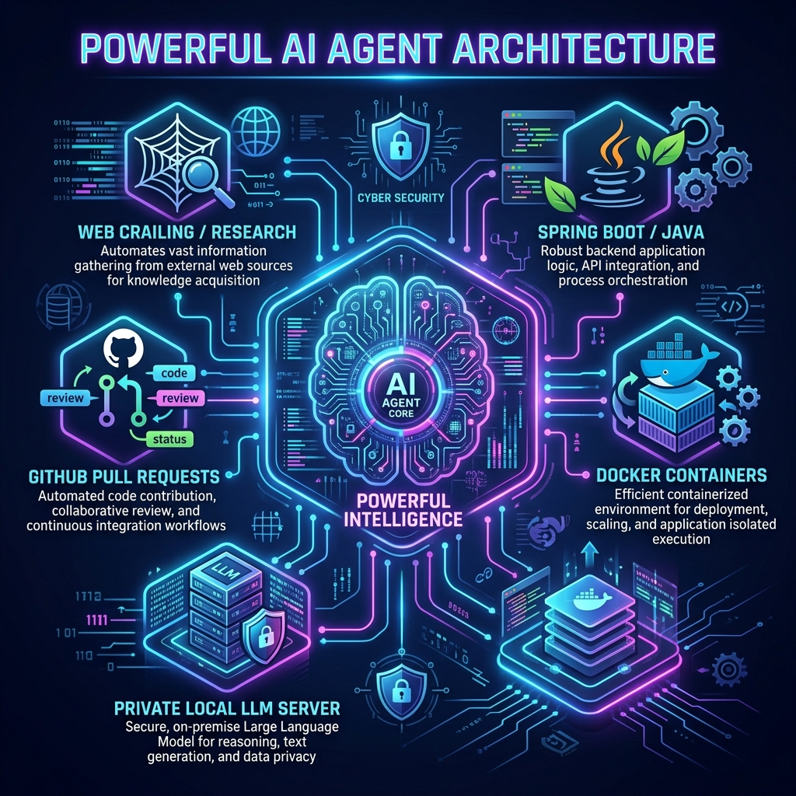

# Spring AI Autonomous Blog Agent



## 🚀 Overview
The **Spring AI Autonomous Blog Agent** is a powerful, self-contained AI worker designed to run scheduled background tasks using Spring Boot and local/private Large Language Models (LLMs). 

Instead of relying on fragile web scrapers or manual intervention, this application operates fully autonomously inside a Docker container. It wakes up on a schedule, conducts extensive cybersecurity research using a curated web crawler, drafts a comprehensive 1,000+ word blog post, and automatically submits the final draft for your review via a **GitHub Pull Request**.

## 🧠 The Architecture: Frontier Models & Local LLMs
This agent demonstrates the true power of hooking up robust Java application logic (Spring Boot) directly to an LLM.

```mermaid
graph TD
    A[Spring Boot Scheduled Cron] -->|Trigger (Mon & Thu)| B(ChatClient Agent)
    B -->|Tool Call| C[WebCrawlerConfig]
    C -->|Fetch HTML| D[(Top 25 Security Sites)]
    D -.->|Extract Context| C
    C -->|Return Context| B
    B -->|Prompt + Context| E{Local/Private LLM}
    E -->|Analyze & Write| B
    B -->|Output HTML| F[Save to blog_draft.html]
    F --> G[Execute Git & GitHub CLI]
    G --> H((Open GitHub Pull Request))
    H -->|Email Notification| I[Human Reviewer]
```

### Why This Is Powerful
* **Total Privacy:** By hooking this agent up to a private LLM (like `llama3.2` running locally via Ollama), you can scrape, parse, and analyze highly sensitive security data without ever sending prompts to a public frontier model.
* **Agentic Tooling:** The LLM doesn't just generate text; it is provided with Spring AI `@Tool` functions, allowing it to actively request crawls of specific industry-leading websites (like Krebs on Security, OWASP, etc.) on demand.
* **Human-in-the-Loop Workflow:** Writing directly to production blogs can be dangerous if an AI hallucinates. By integrating the GitHub CLI natively into the agent's logic, it creates a Pull Request branch for every draft. This triggers a standard GitHub email notification, allowing you to peer-review the AI's work just like a human colleague before merging.

## 🛠️ Features
- **Curated Web Crawling:** Pre-configured to search the top 25 industry sites for Mobile Security, Cryptography, AppSec, and AI Security.
- **Autonomous Scheduling:** Uses Spring's `@Scheduled` annotation to run independently on a strict cron schedule.
- **Docker Ready:** Fully containerized. Includes a multi-stage `Dockerfile` that packages the application alongside Git and the GitHub CLI.
- **GitHub Actions CI/CD:** Automatically builds and pushes the container to Docker Hub on every push to `main`.

## ⚙️ Setup & Installation

### 1. Configuration
Copy the provided template to create your secure configuration:
```bash
cp src/main/resources/application.properties.template src/main/resources/application.properties
```
Fill in your OpenAI API key or configure your local LLM endpoints (e.g., Ollama).

### 2. Docker Compose
To run this application securely without exposing keys:
1. Ensure your `.env` or environment holds `GITHUB_TOKEN` (required for the agent to open PRs).
2. Run `docker-compose up -d`
3. The agent will silently run in the background, waking up on its scheduled days to research, write, and open Pull Requests.

## 🤝 Contributing
Since this agent opens its own Pull Requests, it practically contributes to itself! But human contributions are welcome too.
