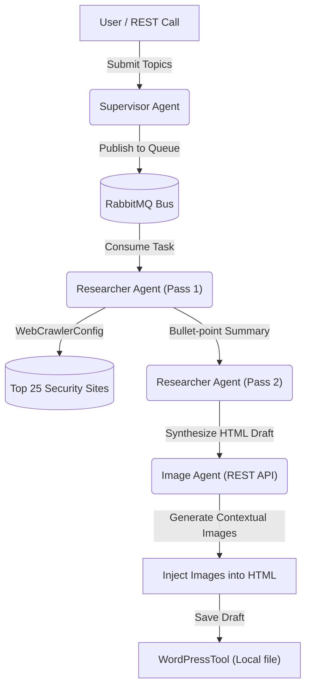

# Spring AI Autonomous Blog Agent


## 🚀 Overview
The **Spring AI Autonomous Blog Agent** is a powerful, multi-agent AI system designed to run complex asynchronous tasks using Spring Boot and local/private Large Language Models (LLMs). 

Operating autonomously inside a Dockerized architecture, it utilizes an asynchronous **RabbitMQ** message bus to decouple request handling from long-running inference tasks. It features a Supervisor Agent that queues research topics, a Researcher Agent that performs a two-pass deep-dive (fact gathering and html synthesis) using a curated web crawler, and an Image Agent that dynamically creates header and inline images using vision models. Finally, the composed output is saved locally or submitted for review.

## 🧠 The Architecture: Multi-Agent Microservices
This system demonstrates the true power of scaling robust Java application logic (Spring Boot) and asynchronous event-driven queues with LLMs.



### Why This Is Powerful
* **Asynchronous Decoupling:** By utilizing RabbitMQ, the Supervisor can instantly accept a large batch of research topics and free up the HTTP thread, while the Researcher Agent processes them sequentially or in parallel without protocol timeouts.
* **Multi-Pass Reasoning:** The Agent architecture splits complex generation into dedicated steps (Fact Gathering vs Drafting), drastically reducing hallucinations and formatting errors.
* **Specialized Agent Delegation:** Complex visual work is delegated to a separate, dedicated Image Agent running specific vision models (`qwen3-vl:latest`), keeping the Researcher focused strictly on language and analysis (`qwen3.5:9b`).

## 🛠️ Features
- **Curated Web Crawling:** Pre-configured to search the top 25 industry sites for Mobile Security, Cryptography, AppSec, and AI Security.
- **Autonomous Scheduling:** Uses Spring's `@Scheduled` annotation to run independently on a strict cron schedule.
- **Docker Ready:** Fully containerized. Includes a multi-stage `Dockerfile` that packages the application alongside Git and the GitHub CLI.
- **GitHub Actions CI/CD:** Automatically builds and pushes the container to Docker Hub on every push to `main`.

## ⚙️ Setup & Installation

### 1. Configuration
Copy the provided template to create your secure configuration:
```bash
cp src/main/resources/application.properties.template src/main/resources/application.properties
```
Fill in your OpenAI API key or configure your local LLM endpoints (e.g., Ollama).

### 2. Docker Compose
To run this application securely without exposing keys:
1. Ensure your `.env` or environment holds `GITHUB_TOKEN` (required for the agent to open PRs).
2. Run `docker-compose up -d`
3. The agent will silently run in the background, waking up on its scheduled days to research, write, and open Pull Requests.

## 🤝 Contributing
Since this agent opens its own Pull Requests, it practically contributes to itself! But human contributions are welcome too.
