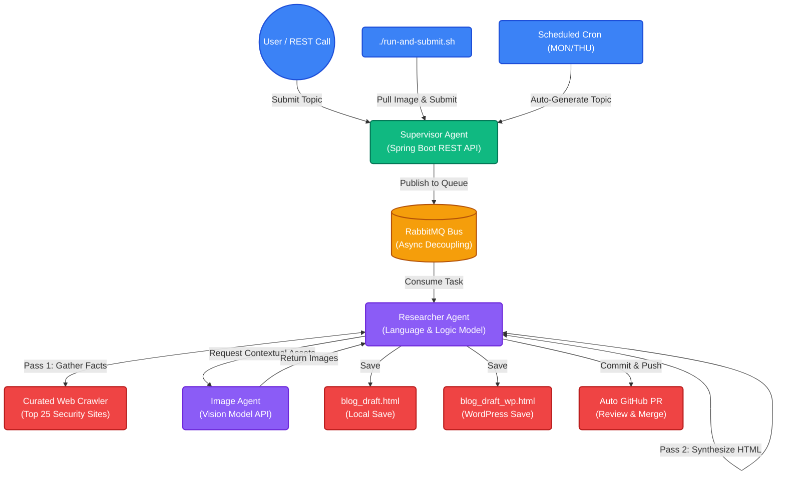

# 🤖 Spring AI Autonomous Blog Agent

   

**A highly robust, multi-agent AI system built to run complex asynchronous tasks utilizing Spring Boot and local/private Large Language Models (LLMs).**

This project demonstrates the true power of scaling robust Java application logic (Spring Boot) and asynchronous event-driven queues (RabbitMQ) with LLMs. By decoupling HTTP requests from long-running inference tasks, it achieves incredible resilience, making it perfect for pairing with powerful frontier models or private, locally-hosted LLMs (like `qwen3.5:9b`).

---

## 🚀 The Power of the Architecture

When working with LLMs, inference takes time—especially when executing a multi-pass reasoning chain that involves deep-dive web crawling, fact synthesis, and image generation. Traditional synchronous REST APIs often time out or lock up valuable threads during these operations.

**This agent solves that problem.**

By utilizing a **RabbitMQ message bus**, the system instantly accepts a large batch of research topics and frees up the HTTP thread. The specialized agents then process the tasks sequentially or in parallel without any risk of protocol timeouts.

### 🧠 Multi-Agent Microservices Workflow



### Why Specialized Agents?
Complex visual work is delegated to a separate, dedicated **Image Agent** running specific vision models (e.g., `qwen3-vl:latest`). This keeps the **Researcher Agent** focused strictly on language, analysis, and HTML drafting, drastically reducing hallucinations and formatting errors.

---

## ✨ Features
- **Asynchronous Decoupling:** Never drop a request. Send as many topics as you want; the agent works through them at its own pace.
- **Curated Web Crawling:** Pre-configured to search the top industry sites for Mobile Security, Cryptography, AppSec, and AI Security.
- **Autonomous Scheduling:** Uses Spring's `@Scheduled` annotation to run completely independently on a strict cron schedule (e.g., every Mon/Thu).
- **Auto-Pull Requests:** The agent practically contributes to itself! It executes CLI commands to create its own Git branch, commits the generated `.html` files, and opens a GitHub Pull Request for your review.
- **WordPress Ready:** Generates both a raw local draft (`blog_draft.html`) and a WordPress-optimized draft (`blog_draft_wp.html`).
- **Dynamic File Generation:** Automatically saves HTML drafts to the `output/` directory with filenames matching the requested topic (e.g., `output/ai-code-tech-debt.html`). These files are automatically synced to your host machine when running via Docker.
- **Local Application Logging:** Keeps a clean, overwritten `request-activity.log` tracing all agent interactions on every application start via a custom Logback configuration.
- **Automated Workflows:** Features parallelized GitHub Actions workflows for security scanning (Gitleaks, Semgrep, Trivy running concurrently to reduce latency) and nightly dependency updates (driven by a custom Python script that queries Maven Central metadata and writes updates to `build.gradle` automatically).
- **High-Throughput Asynchronous Coordination:** The Supervisor Agent utilizes non-blocking `CompletableFuture` execution for message listening, preventing threads from blocking on slow external tasks (like image generation) and allowing concurrent task processing.

---

## 🛠️ Setup & Installation

### 1. Using Pre-built Container Images
You don't need to build the application locally. Pre-built, multi-platform (`amd64` and `arm64`) images are automatically published to both Docker Hub and the GitHub Container Registry (GHCR).

**Docker Hub:**
```bash
docker pull jsoehner/spring-ai-agent:latest
```

**GitHub Container Registry (GHCR):**
```bash
docker pull ghcr.io/jsoehner/spring-ai-blog-agent:latest
```

### 2. Configuration & Settings Location
The primary settings for the agents are controlled through environment variables injected into the containers. The easiest way to configure these is by modifying the `docker-compose.yml` file.

Inside `docker-compose.yml`, you will find `environment:` blocks for each agent (`supervisor-agent`, `researcher-agent`, `image-agent`). Ensure your `.env` or local environment holds your `GITHUB_TOKEN` (required for the agent to open PRs automatically).

### 3. LLM Configuration Options
You can configure the system to use different LLM providers by adjusting the environment variables. Here are the available options depending on your setup:

#### Option A: Local LLM via Ollama (Default)
If you are running Ollama locally, use the native Ollama auto-configuration.
- **Variable:** `SPRING_AI_OLLAMA_BASE_URL=http://<your-ip>:11434`
- **Gotcha:** Do *not* append `/v1` when using the native Ollama integration.

#### Option B: Local LLM via Open-WebUI
If you are routing requests through an Open-WebUI instance.
- **Variable:** `SPRING_AI_OPENAI_BASE_URL=http://<your-ip>:8080/api`
- **Gotcha:** You *must* append `/api` to the Open-WebUI base URL. Spring AI appends the rest automatically. Omitting `/api` hits the web frontend and causes a `405 Method Not Allowed`.

#### Option C: Local LLM via OpenAI Starter pointing to Ollama
If you prefer to use the Spring AI OpenAI starter to communicate directly with Ollama.
- **Variable:** `SPRING_AI_OPENAI_BASE_URL=http://<your-ip>:11434/v1`
- **Gotcha:** You *must* explicitly include `/v1` in the URL, otherwise you will receive a `404 Not Found` error.

> [!WARNING]
> **Dependency Conflict:** If your `build.gradle` includes both `spring-ai-starter-model-ollama` and `spring-ai-starter-model-openai`, Spring will fail to start due to ambiguous `ChatModel` beans. You **must** disable one of the auto-configurations in your `docker-compose.yml` environment block. For example: 
> `SPRING_AUTOCONFIGURE_EXCLUDE=org.springframework.ai.model.openai.autoconfigure.OpenAiChatAutoConfiguration`

### 4. Running the Application
Once your `docker-compose.yml` is configured with your desired LLM endpoints and your `GITHUB_TOKEN`, you can start the system using the provided script. This script intelligently builds a local image if it detects uncommitted changes in your `src/` directory, otherwise it falls back to pulling the latest prebuilt image. It also checks if all containers are already operational and skips the environment restart if they are:

```bash
./run-and-submit.sh "AI code tech debt"
```

> **Note:** If the script times out waiting for the Supervisor Agent API, the pre-built image might be outdated. Append the `--build` flag to force it to use your local source code:
> ```bash
> ./run-and-submit.sh --build "AI code tech debt"
> ```

### 5. Watching it Work
Because the system is decoupled, your script will return a success message instantly once the topic is queued. To watch the AI "think" in real-time as it gathers facts and drafts the HTML, simply tail the logs:

```bash
docker compose logs -f researcher-agent
```

### 6. Autonomous Issue Agent (Moved)
The Autonomous Issue Agent has been extracted from this project into its own standalone repository to allow targeting any of your GitHub repositories. 

Please refer to the new project at `gh-issue-agent` on your local filesystem for standalone setup and usage.

### 7. Dependency Updates & Local Docker Verification
To keep dependencies secure and up-to-date, we scan the codebase using the `com.github.ben-manes.versions` plugin and apply necessary overrides. To verify and test dependency updates locally within the multi-agent container environment:
1. Rebuild the application containers:
   ```bash
   docker compose build
   ```
2. Start the services locally:
   ```bash
   docker compose up -d
   ```
3. Monitor startup logs of the supervisor agent to verify correct initialization:
   ```bash
   docker compose logs supervisor-agent
   ```
4. Stop and clean up the containers once verification is complete:
   ```bash
   docker compose down
   ```

---

## 📐 Architecture Decisions (ADRs) & Agent Skills

### Architecture Decision Records (ADRs)
- **[ADR-0001: Security Hardening and Dependency Injection Refactoring](file:///Users/jsoehner/spring-ai-blog-agent/docs/decisions/0001-security-hardening-and-dependency-injection.md)** — Outlines the path traversal protections, SSRF mitigation, TLS option separation, ChatClient builder mutate adjustments, and Spring Dependency Injection configurations implemented to secure and clean the codebase.
- **[ADR-0002: Mitigating DNS Rebinding SSRF and Aligning Project Rules](file:///Users/jsoehner/spring-ai-blog-agent/docs/decisions/0002-mitigating-dns-rebinding-ssrf-and-aligning-project-rules.md)** — Documents the resolutions for DNS Rebinding, SSRF in Python scripts, Docker image layer build sequence, and aligning prompt/filename patterns with the project rules.
- **[ADR-0003: Workflow and Agent Coordination Optimization](file:///Users/jsoehner/spring-ai-blog-agent/docs/decisions/0003-workflow-and-agent-coordination-optimization.md)** — Explains the parallelization of security scans in GitHub Actions, dynamic dependency updates querying Maven Central, and converting Supervisor task processing to asynchronous CompletableFuture coordination.

### Agent Skills
We maintain specialized agent skills inside the `.agents/skills/` directory. New skills can be installed using the `npx skills` tool:
- **[docker-expert](file:///Users/jsoehner/spring-ai-blog-agent/.agents/skills/docker-expert)** — Equips agents with container optimization, multi-stage build patterns, runtime execution analysis, and security hardening expertise.

---

## ⚠️ Gotchas & Troubleshooting

Here are a few common issues and best practices to keep in mind when working with this project:

- **Asynchronous Unit Tests & CompletableFuture:** When wrapping RabbitMQ listener methods or controller actions in asynchronous execution (`CompletableFuture.runAsync`), the main thread will return immediately. Ensure your JUnit tests call `.join()` on the returned Future before verifying assertions (e.g. checking file creation) to avoid race conditions and false successes.
- **GitHub Actions & Node 24:** When a GitHub Action runner complains about Node 20 deprecation, simply injecting `setup-node` does not fix third-party actions. You MUST bump the major version of the affected actions (e.g., `actions/checkout@v7`, `peter-evans/create-pull-request@v8`) for native Node 24 support.
- **Spring AI ChatModel Conflicts:** Do not include both `spring-ai-starter-model-ollama` and `spring-ai-starter-model-openai` dependencies without disabling auto-configuration for one of them (e.g., `spring.autoconfigure.exclude=org.springframework.ai.model.ollama.autoconfigure.OllamaChatAutoConfiguration`). Otherwise, Spring will throw an `UnsatisfiedDependencyException` due to ambiguous `ChatModel` beans.
- **Docker Volume Mapping for Logs:** When mapping a single log file (like `request-activity.log`) as a volume in `docker-compose.yml`, you **must** ensure the file exists on the host machine first. If it does not exist, Docker will automatically create it as a directory, which will cause Logback to crash on startup.
- **Ollama vs Open-WebUI Base URLs:** 
  - When using the Spring AI OpenAI starter pointing directly to Ollama, ensure the base URL explicitly includes `/v1`.
  - When pointing to Open-WebUI, append `/api` to the base URL, or else it will hit the web frontend and result in a `405 Method Not Allowed` error.
- **Spring AI `ChatClient.Builder`:** The `ChatClient.Builder` instances are mutable. Do NOT reuse the same builder instance to configure multiple clients by calling `.defaultSystem(...)`, as it will overwrite the configuration for all clients. Call `.build()` to create a base `ChatClient`, and then use `.mutate()` to branch off separate configurations.
- **Docker Networking:** Avoid using hostnames like `open-webui` in your configuration unless they are explicitly resolvable in the Docker network. Prefer explicit IP addresses (e.g., `192.168.100.190`).
- **Spring AI 2.0.0 Naming:** Starting with Spring AI 2.0.0, dependencies require the `-model-` segment (e.g., `spring-ai-starter-model-openai` instead of `spring-ai-starter-openai`).
- **Search Tool Fallbacks:** When implementing web search tools for AI agents (like the Researcher Agent), prefer using open APIs (like the Wikipedia API) instead of scraping search engines (e.g., DuckDuckGo) as they aggressively block automated requests. Additionally, ensure the fallback `webcrawler.default.urls` contains a solid list of generic security-related URLs.
- **Local File Output Naming:** When saving generated HTML blog posts locally, standardize the filename by using the topic string, replacing spaces with hyphens, and converting to lowercase (e.g., `topic.replaceAll("\\s+", "-").toLowerCase() + ".html"`).

---

## 🤝 Human in the Loop (Contributing)
While the agent is designed to be highly autonomous—opening its own Pull Requests with finished drafts—human contributions to the core Java architecture or prompts are always welcome. Just branch off, make your tweaks to the agents, and open a PR!
