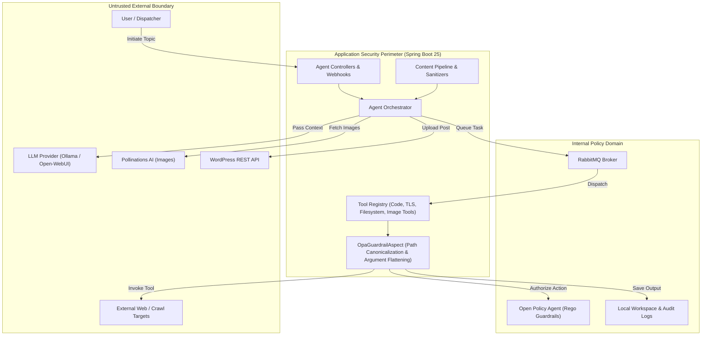

# Security Posture & Architecture Governance

**Project**: `spring-ai-blog-agent`  
**Classification**: Internal / Production Ready  
**Date**: 2026-09-13  
**Auditor**: Security Governance Orchestrator  
**Status**: Governed & Monitored  

---

## 1. Executive Summary

`spring-ai-blog-agent` is an autonomous AI agent system built on Spring AI, Spring Boot 4.1.x, and Java 25. The architecture executes multi-agent workflows (research, fact-checking, content synthesis, image generation, and WordPress publication) coordinated asynchronously via RabbitMQ and secured through a multi-layered defense-in-depth model combining AspectJ guardrails and Open Policy Agent (OPA) fine-grained authorization.

Security governance is codified through 17 Architectural Decision Records (`docs/adr/`), automated CI/CD pipeline scans (Gitleaks, Semgrep, Trivy), Dependabot supply chain controls with 7-day cooldown periods, automated ADR gatekeeping, and branch/codeownership policies.

---

## 2. Repository Profiling & Baseline Controls

| Dimension | Specification & Governance Controls |
| :--- | :--- |
| **Language & Runtime** | OpenJDK 25 (Java 25 toolchain enforced in Gradle & Docker multi-stage builds) |
| **Framework** | Spring Boot 4.1.1, Spring AI 2.0.0, Jackson, SLF4J (Lombok eliminated) |
| **Messaging** | RabbitMQ with dedicated routing keys and isolated queue configurations |
| **Policy Engine** | Open Policy Agent (OPA) with 60+ Rego v1 modular policies and test suites |
| **CI/CD Workflows** | GitHub Actions with Node 24 native action SHAs, secret scanning, SAST, and SCA |
| **Dependency Management** | Dependabot with automated daily/weekly cadence and required 7-day cooldown |
| **Access Governance** | GitHub `CODEOWNERS` enforcing explicit review on security, policy, and workflow paths |

---

## 3. Threat Modeling & STRIDE Analysis

### STRIDE Assessment

| Threat Vector | Potential Vulnerability | Mitigations & Implemented Controls | Residual Risk Level |
| :--- | :--- | :--- | :--- |
| **Spoofing** | Forged tool requests or hijacked task tokens | Strict Spring bean isolation, validated RabbitMQ queues, and OPA actor identity assertions (`agent_identity.rego`). | **Low** |
| **Tampering** | Directory traversal escaping root workspace (`../etc/passwd`) | Canonical path verification in `OpaGuardrailAspect`, workspace confinement in `StorageService.getSafePath()`, and `agent_files.rego`. | **Low** |
| **Repudiation** | Unlogged agent actions or silent tool executions | Structured audit logging via Logback `request-activity.log`, OPA decision audit trail, and git commit history tracking. | **Low** |
| **Information Disclosure** | Leakage of API tokens, internal paths, or credentials | Gitleaks CI secret scanner, pre-commit credential scanning, `.gitignore` of ephemeral artifacts, and sanitized logging. | **Low** |
| **Denial of Service** | Unbounded web crawling, SSRF loops, or LLM token exhaustion | DNS rebinding SSRF protection (`ADR-0002`), timeout and retry policies (`RetryUtils`), and bounded queue workers. | **Medium** |
| **Elevation of Privilege** | Remote code execution or arbitrary tool invocation via prompt injection | Fail-closed OPA architecture (`ADR-0008`, `ADR-0016`), argument flattening, command whitelisting (`agent_commands.rego`). | **Low** |

---

## 4. Architectural Decision Records (ADR) Governance

All security-significant architectural decisions are recorded under `docs/adr/`:

* **`0000`**: Record Architecture Decisions (Baseline governance policy)
* **`0001`**: Security Hardening & Dependency Injection Refactoring
* **`0002`**: Mitigating DNS Rebinding SSRF and Aligning Project Rules
* **`0007`**: Defense-in-Depth Path Validation
* **`0008`**: OPA Client Hardening and Fail-Closed Behavior
* **`0012`**: Java 25 Upgrade & Gutenberg Block Formatting Normalization
* **`0015`**: Resolve CI/CD Workflow Failures, Node 24 Action Deprecations, and Dependency Upgrades
* **`0016`**: Multi-Layered Security Guardrails for AI Tool Execution

**ADR Gatekeeper**: Enforced locally via `scripts/adr_security_gatekeeper.py` and in CI via `.github/workflows/security-governance.yml`. Pull requests modifying security-sensitive architecture paths without an accompanying ADR are blocked from merging.

---

## 5. Continuous Security Controls & Automated Gates

1. **Pre-Commit Defense**:
   * Cross-platform Git hook (`.git/hooks/pre-commit`, `scripts/adr_security_gatekeeper.py`) inspects staged files for high-entropy secrets and validates ADR compliance.
2. **Static Analysis & SAST**:
   * Semgrep rulesets targeting OWASP Top 10, CWE Top 25, and Java security best practices.
3. **Secret Leak Prevention**:
   * Gitleaks scanning commits and history for high-entropy tokens and API keys.
4. **Supply Chain & Vulnerability Management**:
   * Trivy container and filesystem scanning with SARIF output.
   * Dependabot monitoring Gradle dependencies and GitHub Actions with a mandatory 7-day security cooldown.
5. **Code Ownership & Branch Protection**:
   * `.github/CODEOWNERS` assigns security-critical files to maintainers.

---

## 6. Verification and Maintenance Runbook

| Operation | Command / Procedure |
| :--- | :--- |
| **Local ADR Gatekeeper** | `python3 scripts/adr_security_gatekeeper.py --staged` |
| **Run Unit & Security Tests** | `./gradlew test --rerun-tasks` |
| **Verify OPA Rego Policies** | `opa test security-policies/opa-guardrails/ -v` |
| **Trigger Full Security Scan** | Run GitHub Actions workflow `security-scan.yml` |
